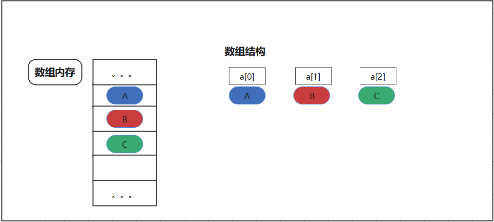
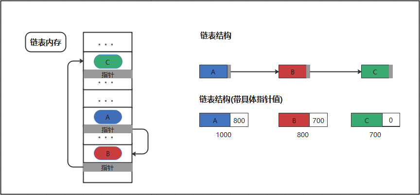

##  表

### 1 什么是表

#### 1.1 表分为链表与线性表

    链表：逻辑上相邻的数据元素，物理次序不一定相邻的。指针指向。（查询慢，扩展容易，空间利用率高）
    
    线性表（数组）：逻辑上相邻的数据元素，物理次序也是相邻的。（查询快，扩展难，空间利用率低） 

每个数据会有一个指针域（里面包含下一个元素的地址，并且前一个元素的指针指向下一个元素）

#### 1.2 各自的优缺点

数组的优点

    随机访问性强
    查找速度快

数组的缺点

    插入和删除效率低
    可能浪费内存
    内存空间要求高，必须有足够的连续内存空间。
    数组大小固定，不能动态拓展

链表的优点

    插入删除速度快
    内存利用率高，不会浪费内存
    大小没有固定，拓展很灵活。

链表的缺点

    不能随机查找，必须从第一个开始遍历，查找效率低

|  -  | 数组| 链表
|  ----  | ----  |----  |
|  读取  | O(1)  |O(n)  |
|  插入  | O(n)  |O(1)  |
|  删除  | O(n)  |O(1)  |

### 2 线性表

表可以通过数组来实现，即为线性表。数组虽然初始可以动态指定大小，但是需要提前估算表的大小，往往需要估算的要比实际大些，会造成空间的大量浪费。
内存上来说物理空间必须连续，需要提前申请一片连续区域，不论是否需要使用到（会造成空间的大量浪费）。

数组的特性导致往插入与删除数据需要移位，所以插入与删除代价昂贵。但是下标获取的方式使获取数据快。

**适用场景**

    读多写少，能提前估计数据量或者数据少的场景。

#### 2.1 实现算法

### 2 链表

单链表、双向链表、循环链表，双向循环链表等。

### 参考