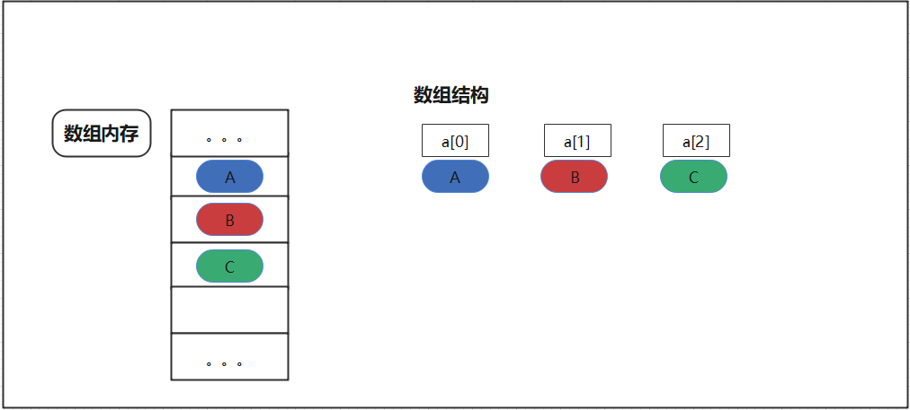

##  数组

### 1 数组(线性表）

    线性表（数组）：逻辑上相邻的数据元素，物理次序也是相邻的。（查询快，扩展难，空间利用率低）

#### 1.1 数组的优缺点

    表可以通过数组来实现，即为线性表。数组虽然初始可以动态指定大小，但是需要提前估算表的大小，往往需要估算的要比实际大些，会造成空间的大量浪费。
    内存上来说物理空间必须连续，需要提前申请一片连续区域，不论是否需要使用到（会造成空间的大量浪费）。
    数组的特性导致往插入与删除数据需要移位，所以插入与删除代价昂贵。但是下标获取的方式使获取数据快。

数组的优点

    随机访问性强
    查找速度快

数组的缺点

    插入和删除效率低
    可能浪费内存
    内存空间要求高，必须有足够的连续内存空间。
    数组大小固定，不能动态拓展

|  -  | 数组| 链表
|  ----  | ----  |----  |
|  读取  | O(1)  |O(n)  |
|  插入  | O(n)  |O(1)  |
|  删除  | O(n)  |O(1)  |

#### 1.2 适用场景

    读多写少，能提前估计数据量或者数据少的场景。

#### 2 数组实现算法

### 参考