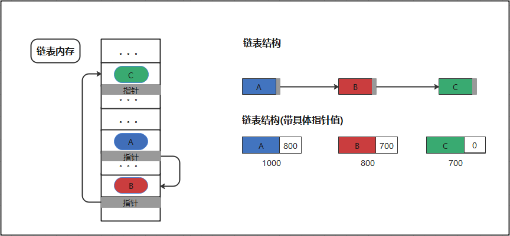

##  链表

### 1 链表(非线性表）

    链表(非线性表）：逻辑上相邻的数据元素，物理次序不一定相邻的。指针指向。（查询慢，扩展容易，空间利用率高）

#### 1.1 链表的优缺点

    链表为线性表。允许存储不连续，避免了插入与删除的线性开销。
    但是指针连接的方式，只能从头或者从尾开始遍历的特性，也使得查找速度不如线性表。

链表的优点

    插入删除速度快
    内存利用率高，不会浪费内存
    大小没有固定，拓展很灵活。

链表的缺点

    不能随机查找，必须从第一个开始遍历，查找效率低

|  -  | 数组| 链表
|  ----  | ----  |----  |
|  读取  | O(1)  |O(n)  |
|  插入  | O(n)  |O(1)  |
|  删除  | O(n)  |O(1)  |

#### 1.2 适用场景

    写操作偏多，不能能提前估计数据量场景。

#### 2 数组实现算法

### 参考