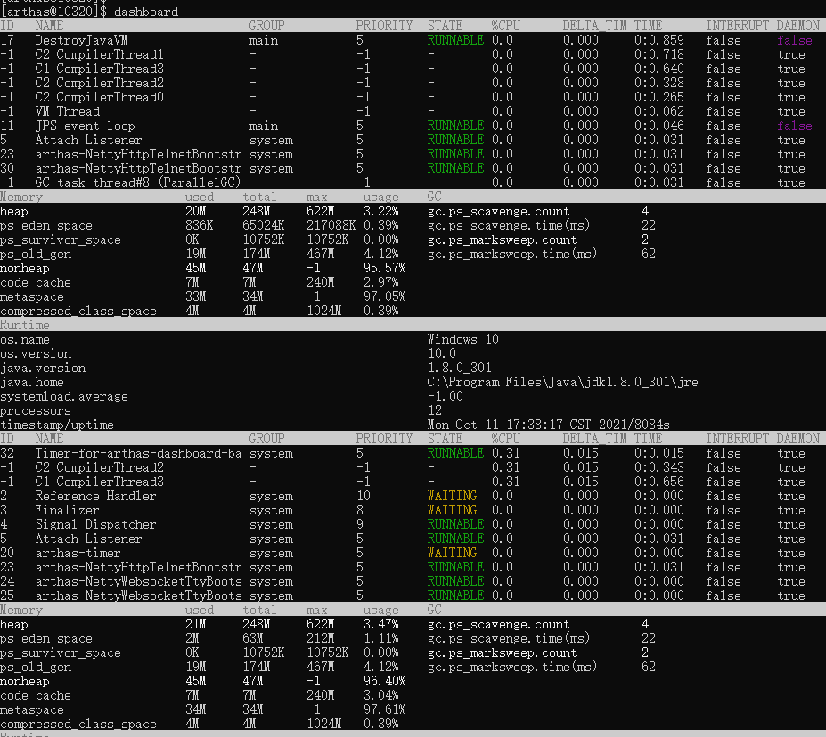

## Arthas

### 1 下载安装 

    下载arthas-boot见 https://arthas.aliyun.com/doc/download.html
    下载math-game见  https://arthas.aliyun.com/doc/quick-start.html

    启动math-game
        curl -O https://arthas.aliyun.com/math-game.jar
        java -jar math-game.jar

    启动arthas
        java -jar arthas-boot.jar

### 2 arthas-boot使用

命令见：https://arthas.aliyun.com/doc/advanced-use.html

### 2.1 查看dashboard

输入dashboard，按回车/enter，会展示当前进程的信息，按ctrl+c可以中断执行。

### 2.2 trace命令排查方法中路径响应时间

    trace 

### 参考

    arthas官网 https://arthas.aliyun.com/zh-cn/

    arthas使用文档 https://arthas.aliyun.com/doc/

    https://blog.csdn.net/qq_21383435/article/details/104766700?utm_medium=distribute.pc_relevant.none-task-blog-2~default~CTRLIST~default-10.no_search_link&depth_1-utm_source=distribute.pc_relevant.none-task-blog-2~default~CTRLIST~default-10.no_search_link

    trace https://blog.csdn.net/xmtblog/article/details/108988898