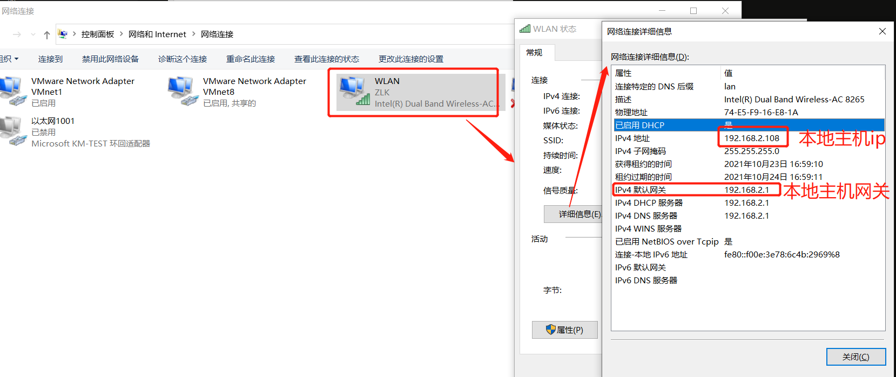
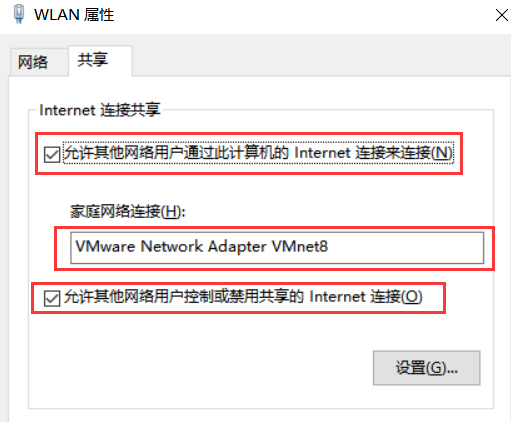
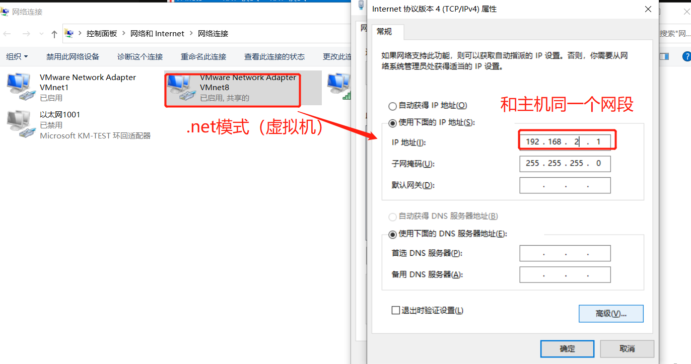
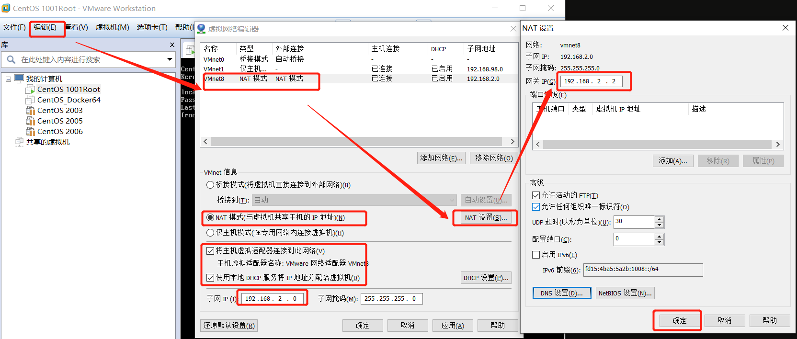
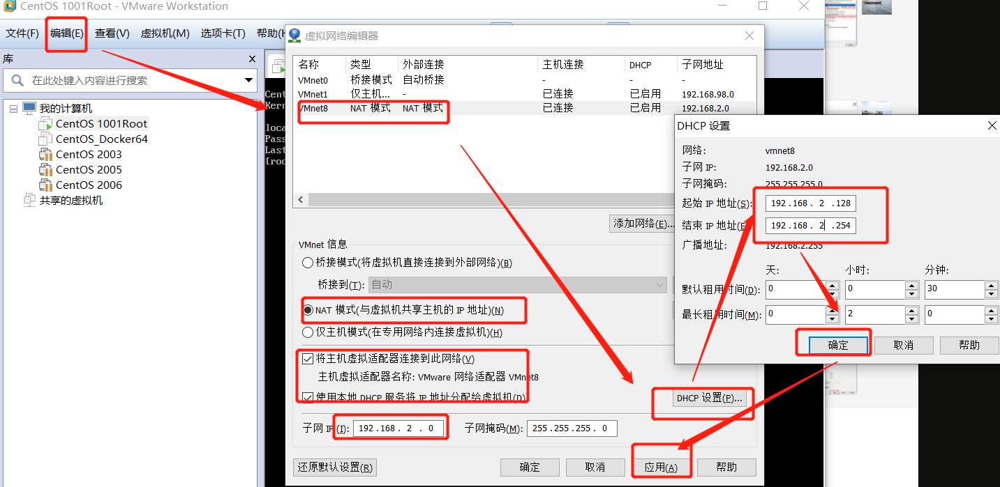

## 虚拟机VM

### 1 VM安装


#### 虚拟机配置固定IP

注：虚拟机ip设置与本地主机在同一个网段。

1.windows 配置网络

本地主机信息与配置：

    VMnet0：用于虚拟桥接网络下的虚拟交换机
    VMnet1：用于虚拟Host-Only网络下的虚拟交换机
    VMnet8：用于虚拟NAT网络下的虚拟交换机
    VMware Network AdepterVMnet1：Host用于与Host-Only虚拟网络进行通信的虚拟网卡
    VMware Network Adepter VMnet8：Host用于与NAT虚拟网络进行通信的虚拟网卡

本地主机ip与网关详情



本地主机共享配置（让虚拟机可以使用网络）



虚拟机net模式




2.VM虚拟机网络编辑

VM-->编辑-->虚拟机网络编辑

虚拟机NAT设置网关与子网ip(虚拟机)


虚拟机NAT设置ip范围


3.改变虚拟机网络连接模式。

    切换目录：cd /etc/sysconfig/network-scripts
    
    编辑ifcfg-ens33：vi ifcfg-ens33
    
    重启网卡：service network restart

ifcfg-ens33如下：    
```java
TYPE=Ethernet
PROXY_METHOD=none
BROWSER_ONLY=no
BOOTPROTO=static
DEFROUTE=yes
IPV4_FAILURE_FATAL=no
IPV6INIT=yes
IPV6_AUTOCONF=yes
IPV6_DEFROUTE=yes
IPV6_FAILURE_FATAL=no
IPV6_ADDR_GEN_MODE=stable-privacy
NAME=ens33
UUID=e8e09122-b81b-4148-8ca5-5b45ac8117da
DEVICE=ens33
ONBOOT=yes
#虚拟机地址
IPADDR=192.168.2.102
NETMASK=255.255.255.0
#虚拟机网关
GATEWAY=192.168.2.2
```

### 参考

    虚拟机net模式： https://www.cnblogs.com/Y-wee/p/14066227.html
