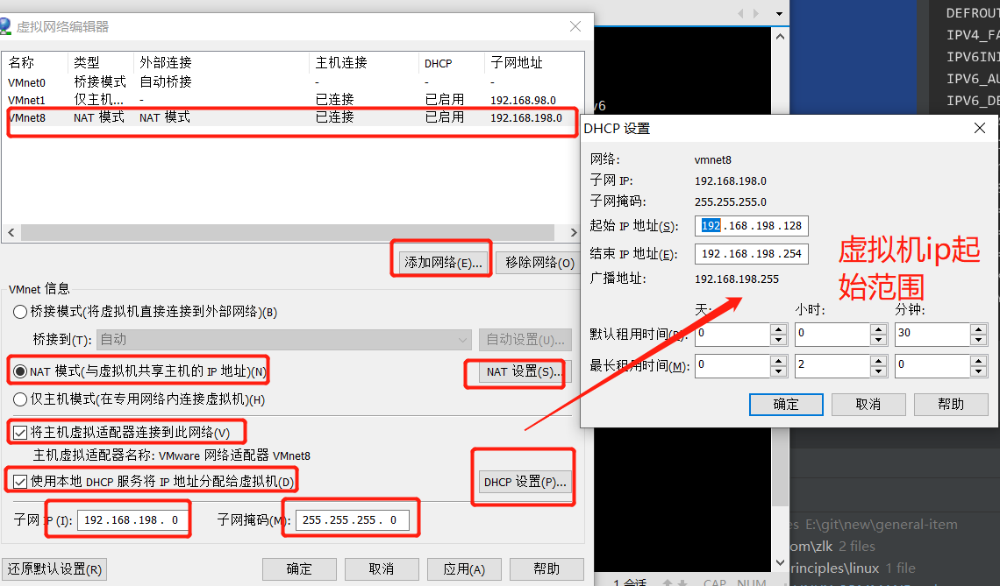
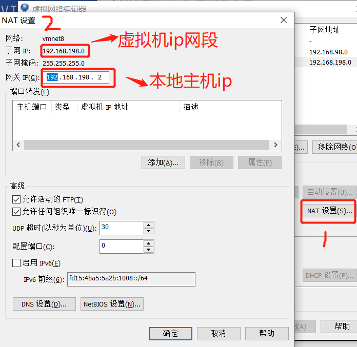

## 虚拟机VM

### 1 VM安装


#### 虚拟机配置固定IP

1.windows 配置网络


2.VM虚拟机网络编辑

VM-->编辑-->虚拟机网络编辑



NAT设置


3.改变虚拟机网络连接模式。

    切换目录：cd /etc/sysconfig/network-scripts
    
    编辑ifcfg-ens33：vi ifcfg-ens33
    
    重启网卡：service network restart

ifcfg-ens33如下：    
```java
TYPE=Ethernet
PROXY_METHOD=none
BROWSER_ONLY=no
BOOTPROTO=static
DEFROUTE=yes
IPV4_FAILURE_FATAL=no
IPV6INIT=yes
IPV6_AUTOCONF=yes
IPV6_DEFROUTE=yes
IPV6_FAILURE_FATAL=no
IPV6_ADDR_GEN_MODE=stable-privacy
NAME=ens33
UUID=e8e09122-b81b-4148-8ca5-5b45ac8117da
DEVICE=ens33
ONBOOT=yes
IPADDR=192.168.198.202
NETMASK=255.255.255.0
GATEWAY=192.168.198.2
```


### 参考

    https://blog.csdn.net/weixin_42784820/article/details/88648525
