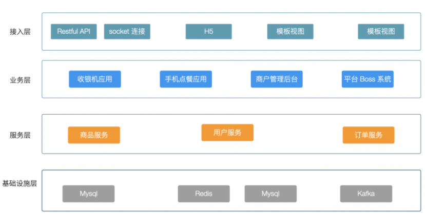
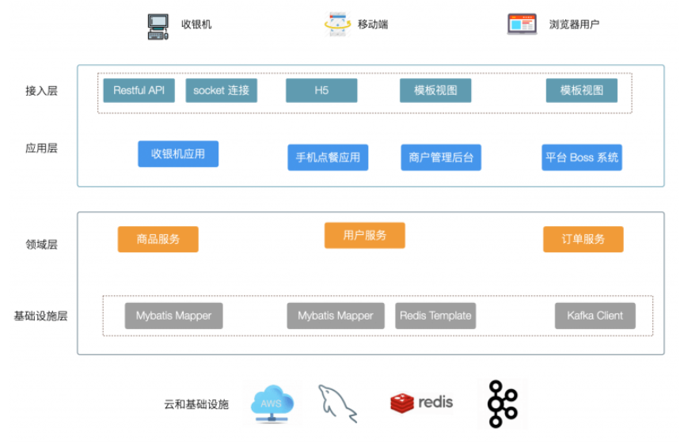

## DDD 领域驱动模型

应用层：负责业务逻辑（包含数据权限），调用不同的服务，进行业务数据聚合，分布式事务等。调用应用层，对接入层提供能力。也就是系统中台。
领域层：不包含特点业务逻辑，提供具体服务的数据库读写能力给到应用层。调用基础设施，对应用层提供能力。

### 1  DDD 领域驱动模型简介

    DDD最重要的思想:关注系统复杂性，提出一套复杂性治理的方法论，保证系统快速响应业务的变化。第三次软件危机的到来是以为软件行业的属性从建筑行业转移为服务行业。
    用户的耐心是有限的，服务软件要做到快速响应用户请求，这需要高性能；用户是希望享受更多、更优质服务的，公司业务要想竞争成功，就需要快速提供这些服务，这就要求系统业务的
    快速落地和迭代。DDD解决的问题就是上述所提到的，它关注的是业务的快速迭代，它是软件设计领域的方法论，在软件设计这一面保证业务快速响应，同时也需要在软件迭代的工作模式
    和系统架构这两个面一同支持,多维度出击，实现集团业务快速迭代的战略能力。

注：（服务间低耦合、服务内高内聚）

    分布式系统的问题，DDD 都解决不了。
    DDD 的作用只有一个：在单体中划分模块，在分布式系统中划分服务。 服务划分的良好，关联查询、授权、分布式一致性等问题可以被很好的解决，也就是我们常常说的解耦。
    
    在每一个不同的演化层次下，谈 DDD 的代码架构才有意义。例如单体系统没有必要过多分层，避免样板代码大量出现；微服务系统则需要小心分层，并严格执行，否则修改成本非常高。另外也需要解决该层次下的技术问题，微服务需要解决分布式事务问题、分布式授权问题、分布式缓存问题、性能问题等。

常见的三层架构

实践中我们发现，接入层是由应用场景解决的，因此接入层需要在特定应用场景下使用。收银机应用下，接入层是 Restful API 以及 socket 连接实现的实时通信，商户管理和平台管理无需使用这些接入方法，在不前后端分离的情况下，模板引擎也足够使用。

同样的，基础设施层是和领域层绑定到一起用于实现业务逻辑和规则，底层基础设施的选择由领域层决定。商品服务主要是和数据库打交道，需要使用 Mybatis，但是用户认证服务（图上未体现）可能只需要 Redis 做分布式会话即可。

接入层和技术设施层，更应该看做两个亚层。结合 DDD 术语将示例图调整如下：

DDD 四层模型图

### 2

#### 2.1 应用层

餐饮系统是一个非常复杂，具有多端、多租户的系统，往往有收银机应用、手机点餐应用、商户管理、平台管理等应用，
从而组合成一个系统。在有些公司的语境里，应用层往往是根据用户角色划分的，被称为”业务面“。

应用层的特点：
    
    关心处理完一个完整的业务
    该层只负责业务编排，对象转换，实际业务逻辑由领域层完成
    不关心请求从何处来，但是关心谁来、做什么、有没有权限做
    集成不同的领域服务解决问题
    最终一致性（最终一致性对业务有侵入）事务放到这层
    对应到分布式系统中的中台等概念
    方法级别的功能权限控制放到这层
    只产应用异常，对应 HTTP 状态码 403、401
    准单体系统下，按照应用划分模块

    应用层是由众多业务聚合而成的业务集合，都是同一类、功能类似、共同支撑着大业务闭环。
    应用层职责是保证业务正确性（事务/最终一致性）、业务权限、业务编排、对象转换、完整的大业闭环。
    
    熟悉mvc代码架构模式的开发人员，代码结构分为model，view（前端代码模板），controller，service，dao/mapper。
    但是在DDD模式下，比较流行的是四层架构：展现层（前后端分离case）/接入层，应用层、领域层、基础设施层。

#### 2.2 接入层

对接入层来说，我们可以看到，实际上接入层是依附于应用层存在的，随着前后端分离，Restful API 成了主流，对简单的系统来说这一层越来越弱化。对于有终端接入的系统来说，接入层并不简单，需要处理各种协议适配：XMPP、websocket、MQTT 等。在复杂度不高的情况下，我们往往把接入层和应用层合并部署，这里往往凭经验来决定。如果对分布式级别有了认识，可以更为科学的选择是否要将接入层和应用部署到一起。

接入层的特点：

    关心视图和对外的服务，Restful、页面渲染、websocket、XMPP 连接等
    如果没有多种接入方式，可以和应用层合并
    对应到分布式系统中的网关、BFF、前台等概念
    只产生接入异常，例如数据校验，对应 HTTP 状态码 400、415 等
    一个应用可以有多个接入层
    接入层做和业务规则无关的 bean validation 验证
    准单体系统下，按照连接方式分包

#### 2.3 领域层（应该剥离特定业务逻辑，只提供基础服务）

对于领域层来说，很多互联网公司没有这个概念，将这些实现混合在应用层隐藏实现了，造成业务规则不一致。随着前后端分离的发展，2013 年左右我也开始前后端分离实践，接入层剥离出去后，后端开发者开始审视是否需要抽象出一层来复用业务逻辑。当时大部分互联网公司称为服务，也就是 SOA 架构，大量使用 XML 和 SOAP 技术。

领域层的特点：
    
    不关心场景，关心模型完整性和业务规则
    不关心谁来，不关心场景完整的业务(全闭环业务)，关心当前上下文的业务完整
    强一致性事务放到这层，聚合的事务是 "理所当然的"
    对应到分布式系统中的 domain service、后台等概念
    领域层做业务规则验证
    产生业务规则异常，例如用户退款条件不满足，对应状态码 412、419 等
    数据权限放到这层（比如只允许删除自己创建的商品），因为数据权限涉及业务规则
    准单体系统下按照上下文分包，上下文之间调用必须走领域 domain service，目的就是解耦
    上下文中分聚合，聚合根要足够小，只允许聚合根拥有对应的 domain service
    根据业务情况，参考反范式理论，跨上下文使用值对象做必要的数据冗余

#### 2.4 基础设施层

对于基础设施层来说，技术设施层并不是指 MySQL、Redis 等外部组件，而是外部组件的适配器，Hibernate、Mybatis、Redis Template 等，因此在 DDD 中适配器模式被多次提到，基础设施层往往不能单独存在，还是要依附于领域层。技术设施层的适配器还包括了外部系统的适配，互联网产品系统的外部系统非常多，常见的有活体监测、风控系统、税务发票等。

技术设施层的特点：
    
    关心存储、通知、第三方系统等外部设施（防腐层隔离）
    如果使用自动化的 ORM，这层可以在一定程度上省略
    基础设施异常，应丢出内部异常，对应状态码 500
    准单体系统下按照 adapter 分包
    基础设施的权限由配置到应用的凭证控制，例如数据库、对象存储的凭证，技术设施层不涉及用户的权限

**DDD 分层的注意事项**
    
    DDD 分层架构需要认识到一点是，有时候我们在项目中找不到每层之间的明显的界限，那是因为我们使用的框架帮我们完成某一层。MVC 框架，Spring MVC、Jersey 帮我们搞定了接入层的事情，Hibernate、Redis Template 让我们感觉不到基础设施层。四层模型并不是一个刻板的教条，应该和你选用的框架做出调整，DDD 的作者也多次强调这一点。
    
    另外，基础设施层和接入层需要注意两点（这两者都具有适配器的属性）：
    
    接入层指的是服务端用于适配端侧的部分，而非端侧本身。因为接入层本来就依赖应用层，没有人使用接口在这里做依赖倒置，所以又被称作主动适配。
    
    基础设施层指的是适配基础设施的部分，而非基础设施本身。开发者往往希望数据访问的接口有应用来定义，避免和基础设施绑定，提供替换的可能，因此这里往往大量使用接口，会有一些依赖倒置的实现，所以又被称作为被动适配。关于依赖倒置的知识，可以了解面向对象的一些基础概念。

### 参考

    DDD http://bittechblog.com/blog/article/66 

    DDD分布式系统使用 http://bittechblog.com/blog/article/65