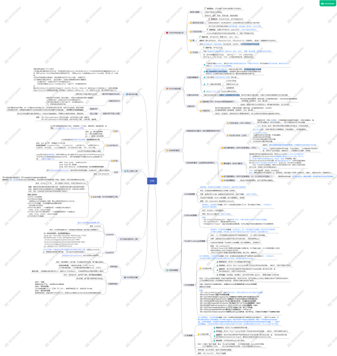
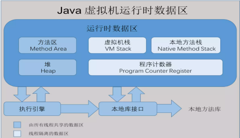
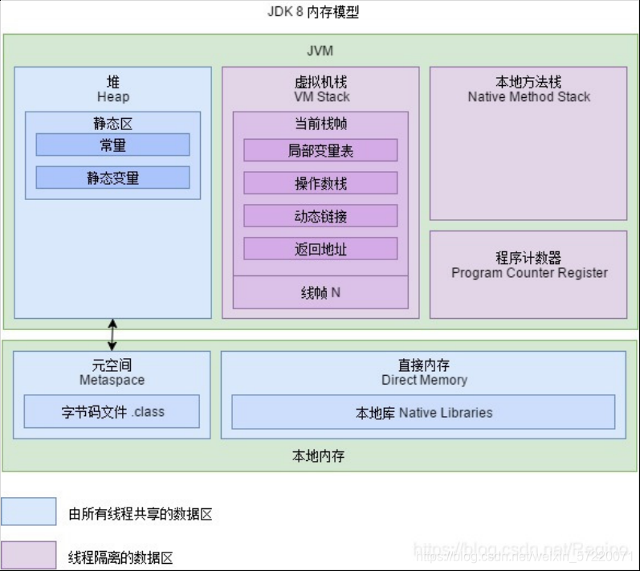

## JAVA虚拟机（JDK 8）

### 1 JVM内存区域分布

详细见： [JVM内存区域分布(JAVA8)](https://github.com/zlk-github/general-item/blob/master/src/main/java/com/zlk/jdk/jvm/README-MODEL.md#JVM内存区域分布(JAVA8))

下图为java7 内存模型

下图为java8 内存模型

    
    JAVA8相较于JAVA7，去除了方法区（永久代）。
        方法区中的静态变量、字符串常量池等移到堆内存中。
        原方法区中存储的类信息、编译后的代码数据等已经移动到了元空间（MetaSpace）中，元空间并没有处于堆内存上，而是直接占用的本地内存。元空间的大小仅受本地内存限制，但可以通过-XX:MetaspaceSize和-XX:MaxMetaspaceSize来指定元空间的大小。
    去除永久代原因： 永久代GC困难，容易出现内存溢出与性能问题。

Java8的JVM内存模型包括，堆、栈（java虚拟机栈与本地方法栈）、程序计数器以及元空间。

**线程共享区域**：

    元空间（使用本地内存）：类信息（类版本号、方法、接口）;（其中元空间是以前JAVA7方法区的部分实现）
    堆：存放对象实例（对象与数组），静态区（常量、静态变量）。

**线程隔离区域**：

    程序计数器：执行字节码的执行指示器;
    虚拟机栈：针对Java方法，存储局部变量、操作数、动态链接（对象引用地址）、方法出口等;
    本地方法栈：针对本地方法存储局部变量、操作数、动态链接（本地对象引用地址）、本地方法出口等）。

### 2 JAVA对象创建

    java对象创建
        对象创建顺序
        类加载机制
        CAS

    java 对象内存分布

    对象访问方式
        直接指针
        句柄

### 3 垃圾回收算法

### 4 JVM垃圾回收器

### 5 堆内存分配原则

### 6 线上虚拟机工具

### 7 虚拟机图形话工具

### 8 JVM常见报错与解决方案

### 9 JVM 常用命令与配置

1  看看哪个对象太大 如果是cpu过高就 找到对应线程先jstack 出来文件

2  ./jmap  -histo 9274 | sort -n -r -k 2 | head -20

### 参考

    https://blog.csdn.net/weixin_57220071/article/details/119875033