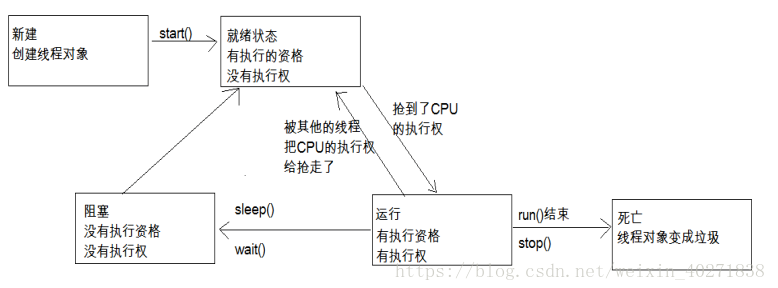

## java多线程

### 1.普通线程创建与线程常见知识。（com.zlk.jdk.thread.general包）

#### 1.1 什么是线程与进程，作用，使用场景

###### 1.1.1 线程介绍

    进程：每个进程都有独立的代码和数据空间（进程上下文），进程间的切换会有较大的开销，一个进程包含1--n个线程。（进程是资源分配的最小单位）
    线程：同一类线程共享代码和数据空间，每个线程有独立的运行栈和程序计数器(PC)，线程切换开销小。（线程是cpu调度的最小单位）

###### 1.1.2 线程优势

    提高并发，充分利用空闲CPU资源。

###### 1.1.3 线程劣势

    1.使用大量的线程，频繁切换线程会消耗资源影响性能。线程需要内存空间；
    2.使用不当会带来隐藏bug(如数据一致性，顺序等问题)；
    3.线程终止需要考虑对其他程序影响；
    4.多线程共享与调用需要考虑数据一致性（锁），以及死锁等问题。

###### 1.1.4 使用场景

    对一些耗时较多的任务可以选择使用多线程，如批量任务，文件读写，网络收发等。

#### 1.2 线程的状态与什么时候达成

线程5个状态：新建、就绪、运行、阻塞、死亡。（待完善）

    1.初始(NEW)：新创建了一个线程对象，但还没有调用start()方法。
    2.运行(RUNNABLE)：Java线程中将就绪（ready）和运行中（running）两种状态笼统的称为“运行”。（就绪状态与运行中）
    线程对象创建后，其他线程(比如main线程）调用了该对象的start()方法。该状态的线程位于可运行线程池中，等待被线程调度选中，
    获取CPU的使用权， 此时处于就绪状态（ready）。就绪状态的线程在获得CPU时间片后变为运行中状态（running）。
    3.阻塞(BLOCKED)：表示线程阻塞于锁。--（加锁）
    4.等待(WAITING)：进入该状态的线程需要等待其他线程做出一些特定动作（通知或中断）。--（锁释放）
    5.超时等待(TIMED_WAITING)：该状态不同于WAITING，它可以在指定的时间后自行返回。
    6.终止(TERMINATED)：表示该线程已经执行完毕。

#### 1.3 线程创建方式

    1.继承Thread类创建线程 -- MyThread类
    2.实现Runnable接口创建线程,重写run()方法。(需要配合Thread使用)  -- MyThreadRunnable类
    3.使用Callable和Future创建线程，重写call()方法，可以拿到线程返回值。(需要配合Thread或者线程池使用)  -- MyThreadCallable类
    4.使用线程池例如用Executor框架，最常用。  -- 详见2.线程池
        // ExecutorService executorService = Executors.newCachedThreadPool();
        // ExecutorService executorService = Executors.newFixedThreadPool(5);
        // ExecutorService executorService = Executors.newSingleThreadExecutor();
        // Executors.newScheduledThreadPool(int)
        自定义（推荐）： new ThreadPoolExecutor(intcorePoolSize, intmaximumPoolSize, longkeepAliveTime,TimeUnitunit,BlockingQueue<Runnable>workQueue)自定义创建

#### 1.4 线程常用方法介绍

    休眠，暂停，停止。
    休眠
        在Java多线程中，可以使用sleep()方法在指定毫秒数内让当前正在执行的线程休眠。
    暂停
        虽然suspend和resume方法可以分别使得线程暂停和回复，但是这两个方法因为有缺点而已经被弃用。
            缺点：
            独占：在使用suspend和resume方法时，如果使用不当，极易造成公共的同步对象独占，使得其他线程无法访问公共同步对象。
            不同步：在使用suspend与resume方法时也容易因为线程而导致数据不同步的情况。
        yield方法
        可以使用yield方法进行暂停。
        yield()方法的作用是放弃当前的CPU资源，将它让给其他任务去占用CPU执行时间。但放弃的时间不确定，有可能刚刚放弃，马上又获得CPU时间片。
    停止
        虽然stop()可以停止一个线程，但是这个方法是不安全的，而且是已经被弃用作废的，最好不要使用它。
    interrupt()方法
        interrupt()方法的使用效果并不像for+break语句那个，马上就停止循环。调用interrupt()方法仅仅是在当前线程中打了一个停止的标记，并不是真正停止线程。
        判断线程是否是停止状态
        this.interrupted()：测试当前线程是否已经是中断状态，执行后具有将状态标志清楚为false的功能,为static方法。
        this.isInterrupted（）：测试线程Thread对象是否已经是中断状态，但是不清除状态标志。
        能停止线程的方法
        在run中加一个判断，如果停止了，则break跳出循环体或者抛出异常。

#### 1.5 线程数的核算

一般说来，大家认为线程池的大小经验值应该这样设置：（其中N为CPU的个数）--服务器上单应用情况下

    •	如果是CPU密集型应用，则线程池大小设置为N+1
    •	如果是IO密集型应用，则线程池大小设置为2N+1

    IO优化中，这样的估算公式可能更适合：
        最佳线程数目 = （（线程等待时间+线程CPU时间）/线程CPU时间 ）* CPU数目
        因为很显然，线程等待时间所占比例越高，需要越多线程。线程CPU时间所占比例越高，需要越少线程。
        比如平均每个线程CPU运行时间为0.5s，而线程等待时间（非CPU运行时间，比如IO）为1.5s，CPU核心数为8，那么根据上面这个公式估算得到：((0.5+1.5)/0.5)*8=32。
        这个公式进一步转化为：最佳线程数目 = （线程等待时间与线程CPU时间之比 + 1）* CPU数目

### 2.线程池

https://mp.weixin.qq.com/s?__biz=MzA3ODIxNjYxNQ==&mid=2247493401&idx=2&sn=08dcf94d57a9ec9e69bb2fbfd4c57a3d&chksm=9f448bd1a83302c7710b3a0d331bf0e70e7ac96e1941933e7027677406c257fb72d7c5fabab5&scene=21#wechat_redirect

#### 2.1 引入线程池背景

程序中大量的线程创建和销毁会占用大量系统资源，且不方便统一管理导致滥用线程影响系统性能。
使用线程池将能对线程进行统一管理（系统线程数不是无止境的），且减少线程创建销毁等开销。
但是有利有弊，使用线程池需要提前预估线程池（系统需要，硬件的限制等等）。

#### 2.2 常见线程池

// ExecutorService executorService = Executors.newCachedThreadPool();

// ExecutorService executorService = Executors.newFixedThreadPool(5);

// ExecutorService executorService = Executors.newSingleThreadExecutor();

// Executors.newScheduledThreadPool(int)

自定义（推荐）： new ThreadPoolExecutor(intcorePoolSize, intmaximumPoolSize, longkeepAliveTime,TimeUnitunit,BlockingQueue<Runnable>workQueue)自定义创建

#### 2.3 ThreadPoolExecutor创建流程

	如果当前线程池中的线程数目小于corePoolSize，则每来一个任务，就会创建一个线程去执行这个任务；
	
	如果当前线程池中的线程数目>=corePoolSize，则每来一个任务，会尝试将其添加到任务缓存队列当中，若添加成功，则该任务会等待空闲线程将其取出去执行；若添加失败（一般来说是任务缓存队列已满），则会尝试创建新的线程去执行这个任务；
	
	如果当前线程池中的线程数目达到maximumPoolSize，则会采取任务拒绝策略进行处理；
	
	如果线程池中的线程数量大于 corePoolSize时，如果某线程空闲时间超过keepAliveTime，线程将被终止，直至线程池中的线程数目不大于corePoolSize；如果允许为核心池中的线程设置存活时间，那么核心池中的线程空闲时间超过keepAliveTime，线程也会被终止。

### 3.常见锁java  

      volatile
      单机锁LOCK，synchronized
      分布式锁：redis,zookpeer,mysql等实现
      乐观锁CAS等
      多线程atomicInteger与分段锁 （https://www.cnblogs.com/muzhongjiang/p/15142938.html）

### 4.线程的原子性问题，可见性问题，有序性问题，并发问题，死锁解决

  
    原子性操作：所谓的原子性就是指该操作不可再分，或者说一个操作或者多个操作要么执行，并且不会被打断，要么就不执行。看例子：
        1.int x = 10;         2.int y = x ;       3.x++;       4.x = x+1;
        这上面这四个语句，那些是原子操作，那些没有原子操作呢？我们来看这四句话都做了些什么：
        第一句：直接把10赋值给x的工作内存，这个操作不可再分，并且很直接，这是原子操作。
        第二句：先去读取x的值，然后再将x的值写入到y的工作内存，这个可分割，并且不直接，这就不是原子操作
        第三句：其实跟第四句一样都是执行x = x+1;线读取x的值，然后进行+1操作，才会将新值写入到x的工作内存，可分割，不是原子操作。
        所以可以看出来，所谓的原子操作，原子性就是直接对某一个变量进行操作，中间没有别的操作。
    
    可见性：当线程1更改了变量的值，但是线程2并不知道，这叫不可见，但是如果线程1操作变量值的时候，线程2知道，那就叫可见。所以可见性就是说线程之间操作共同变量的时候，彼此之间都能知道。
    
    有序性：有序性就是指执行代码是有序的去执行，线程1先执行，完了之后线程2才去执行。
    

### 参考

    并发问题 https://blog.csdn.net/qq_24692041/article/details/60756077

    多线程 https://zhuanlan.zhihu.com/p/27825894?from_voters_page=true

    死锁问题 https://www.cnblogs.com/xiaoxi/p/8311034.html

