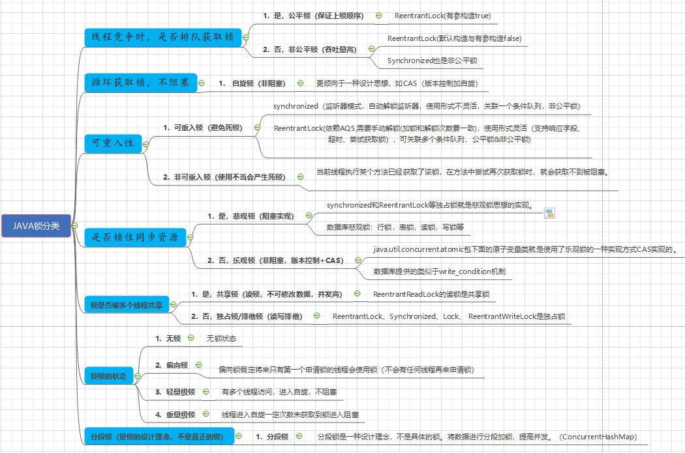

## 常见锁java

      volatile
      单机锁LOCK，synchronized
      分布式锁：redis,zookpeer,mysql等实现
      乐观锁CAS等
      多线程atomicInteger与分段锁 （https://www.cnblogs.com/muzhongjiang/p/15142938.html）

### 2 锁(需要深入了解使用和原理)

-- **需要深入了解使用和原理,待补充完善**

**java锁是什么**：用于并发时的线程阻塞作用。

**思维导图**：

#### 2.1 公平锁FairSync

    多线程按照申请锁的顺序获取锁。--（先进先出原则为公平锁）
    
    java常见公平锁：ReentrantLock(有参构造true)

#### 2.2 非公平锁NonfairSync

    锁的获取不按照申请顺序执行，但是非公平锁的吞吐量大。
    
    java常见非公平锁：ReentrantLock(默认构造与有参构造false),Synchronized也是非公平锁。

#### 2.3 自旋锁

    当一个线程未获取到锁时，会一直循环等待，直到获取到锁才会推出循环，而不是线程挂起活进入睡眠状态。
    --优点：减少线程上下文切换，线程不会阻塞。缺点：循环会比较消耗CPU.
    
    java中自旋锁：更倾向于一种设计思想，如CAS。

#### 2.4 独占锁/排他锁

    锁一次只能被一个线程单独持有。如果线程T对数据A加上排他锁后，
    则其他线程不能再对A加任何类型的锁。获得排它锁的线程即能读数据又能修改数据。

    java中独占锁：ReentrantLock，Synchronized，Lock都是独占锁
                 ReentrantWriteLock是独占锁

#### 2.5 共享锁

    锁可以被多个线程共享。如果线程T对数据A加上共享锁后，则其他线程只能对A再加共享锁，不能加排它锁。获得共享锁的线程只能读数据，不能修改数据。 
    独享锁与共享锁也是通过AQS来实现的，通过实现不同的方法，来实现独享或者共享。

    java中共享锁：ReentrantReadLock的读锁是共享锁,
                读锁的共享可保证并发读是非常高效的，但是读写和写写，写读都是互斥的。

#### 2.6 可重入锁/递归锁（JAVA中使用多）

可重入锁详见：[可重入锁 & 不可重入锁](https://github.com/zlk-github/general-item/blob/master/src/main/java/com/zlk/jdk/thread/lock/reentrant/README-REENTRANT.md#可重入锁&不可重入锁)

    可重入就是说某个线程已经获得某个锁，可以再次获取锁而不会出现死锁。 （可以多次获取相同的锁，不发生死锁）。
    可重复递归调用的锁,同一线程外层函数获取锁后,内层递归函数仍然可以获取锁,并且不发生死锁(前提是同一个对象或者class)
    作用： 避免死锁

    java常见可重入锁有：
          1.synchronized（监听器模式，自动解锁监听器，使用形式不灵活，关联一个条件队列，非公平锁）
          2.ReentrantLock(依赖AQS,需要手动解锁(加锁和解锁次数要一致)，使用形式灵活（支持响应字段、超时、尝试获取锁），可关联多个条件队列，公平锁&非公平锁)*/
    注意：
      ReentrantLock 和 synchronized 不一样，需要手动释放锁，
      所以使用 ReentrantLock的时候一定要手动释放锁，并且加锁次数和释放次数要一样。
      （ReentrantLock加锁次数和释放次数不一样，第二个线程始终无法获取到锁，导致一直在等待。）

#### 2.7 不可重入锁

    所谓不可重入锁，即若当前线程执行某个方法已经获取了该锁，那么在方法中尝试再次获取锁时，就会获取不到被阻塞。--使用不当容易产生死锁。

#### 2.8 悲观锁

    每次拿数据都会上锁，阻塞到释放锁后别人才能拿到锁（共享资源每次只能一个线程使用完释放锁后，别的阻塞线程才能拿到）。

    java常见悲观锁有：
        synchronized和ReentrantLock等独占锁就是悲观锁思想的实现。
    数据库悲观锁：
        行锁，表锁，读锁，写锁等

#### 2.9 乐观锁

    每次拿数据都不会上锁，但是更新时会判断在此期间别人是否更改数据，一般使用版本号机制与CAS实现。
    -- 乐观锁适用于多读的场景，可以提高吞吐量。

    java常见乐观锁有：
        java.util.concurrent.atomic包下面的原子变量类就是使用了乐观锁的一种实现方式CAS实现的。
    数据库悲观锁：
        数据库提供的类似于write_condition机制.

#### 2.10 分段锁
     
    分段锁是一种设计理念，不是具体的锁。将数据进行分段加锁，提高并发。

    java常见分段锁使用有：
    ConcurrentHashMap所使用的锁分段技术，首先将数据分成一段一段的存储，然后给每一段数据配一把锁，当一个线程占用锁访问其中一个段数据的时候，其他段的数据也能被其他线程访问。

    比如：在ConcurrentHashMap中使用了一个包含16个锁的数组，每个锁保护所有散列桶的1/16，其中第N个散列桶由第（N mod 16）个锁来保护。
        假设使用合理的散列算法使关键字能够均匀的分部，那么这大约能使对锁的请求减少到越来的1/16。也正是这项技术使得ConcurrentHashMap支持多达16个并发的写入线程。

#### 2.11 偏向锁 / 轻量级锁 / 重量级锁

偏向锁，轻量级锁，重量级锁是一种锁的状态。

锁的状态：

    1.无锁状态
    2.偏向锁状态
    3.轻量级锁状态
    4.重量级锁状态
    锁的状态是通过对象监视器在对象头中的字段来表明的。
    四种状态会随着竞争的情况逐渐升级，而且是不可逆的过程，即不可降级。锁不可逆是为了提高获取锁和释放锁的效率.
    这四种状态都不是Java语言中的锁，而是Jvm为了提高锁的获取与释放效率而做的优化(使用synchronized时)。

**偏向锁**

    偏向锁是指一段同步代码一直被一个线程所访问，那么该线程会自动测试对象头的Mark Word获取锁。如果测试失败了,再测试以下Mark Word的偏向锁标识是否设置成1(表示当前是偏向锁):如果没用设置,则使用CAS竞争锁,如果设置了,则尝试使用CAS将对象头的偏向锁指向当前线程.
    -- 一段同步代码一直被一个线程所访问

**轻量级**

    轻量级锁是指当锁是偏向锁的时候，被另一个线程所访问，偏向锁就会升级为轻量级锁，其他线程会通过自旋的形式尝试获取锁，不会阻塞，提高性能。
    -- 有多个线程访问，进入自旋，不阻塞

**重量级锁**

    重量级锁是指当锁为轻量级锁的时候，另一个线程虽然是自旋，但自旋不会一直持续下去，当自旋一定次数的时候，还没有获取到锁，就会进入阻塞，该锁膨胀为重量级锁。重量级锁会让其他申请的线程进入阻塞，性能降低
    -- 线程进入自旋一定次数未获取到锁进入阻塞

|   锁状态  | **优点**  | **缺点**| 适用场景
|  ----  | ----  | ----  | ----  |
| 偏向锁  | 加锁解锁不需要额外消耗，性能高 | 如果线程间存在锁竞争，会带来额外的锁撤销消耗 | 适用于只有一个线程访问同步块场景 |
| 轻量级  | 竞争的线程不会阻塞，提高程序的响应速度 | 始终得不到锁的线程，使用自旋会消耗CPU | 追求响应速度，同步块执行速度快 |
| 重量级锁  | 线程竞争不使用自旋，不会消耗CPU | 线程阻塞，响应速度慢 | 追求吞吐量，同步块执行速度较快 |

    对于普通同步方法,锁是当前实例对象
    对于静态同步方法,锁是当前类的Class对象
    对于同步方法块,锁是Synchonized括号里配置的对象

### 3 AQS原理

AQS原理详见：[AQS原理](https://github.com/zlk-github/general-item/blob/master/src/main/java/com/zlk/jdk/thread/lock/README-AQS.md#AQS原理)

    Java中的大部分同步类（Lock、Semaphore、ReentrantLock等）都是基于AbstractQueuedSynchronizer（简称为AQS）实现的。AQS是一种提供了原子式管理同步状态、阻塞和唤醒线程功能以及队列模型的简单框架。
    
    AQS：AbstractQuenedSynchronizer抽象的队列式同步器。是除了java自带的synchronized关键字之外的锁机制。
    
    AQS的全称为（AbstractQueuedSynchronizer），这个类在java.util.concurrent.locks包
    
    AQS的核心思想是，如果被请求的共享资源空闲，则将当前请求资源的线程设置为有效的工作线程，并将共享资源设置为锁定状态，如果被请求的共享资源被占用，那么就需要一套线程阻塞等待以及被唤醒时锁分配的机制，这个机制AQS是用CLH队列锁实现的，即将暂时获取不到锁的线程加入到队列中。
    
    CLH（Craig，Landin，and Hagersten）队列是一个虚拟的双向队列，虚拟的双向队列即不存在队列实例，仅存在节点之间的关联关系。
    
    AQS是将每一条请求共享资源的线程封装成一个CLH锁队列的一个结点（Node），来实现锁的分配。
    
    **实现了AQS的锁有：自旋锁、互斥锁、读锁写锁、条件产量、信号量、栅栏都是AQS的衍生物**

### 参考
    
      可重入锁： https://blog.csdn.net/w8y56f/article/details/89554060
      
      AQS: https://tech.meituan.com/2019/12/05/aqs-theory-and-apply.html

      公平锁与非公平锁： https://mp.weixin.qq.com/s?__biz=MjM5NjQ5MTI5OA==&mid=2651749434&idx=3&sn=5ffa63ad47fe166f2f1a9f604ed10091&chksm=bd12a5778a652c61509d9e718ab086ff27ad8768586ea9b38c3dcf9e017a8e49bcae3df9bcc8&scene=38#wechat_redirect

      可重入锁（清晰）https://blog.csdn.net/mulinsen77/article/details/84583716

      锁与线程池(全) https://blog.csdn.net/qq_50695280/article/details/115099872

      偏向锁，轻量级锁，重量级锁 https://www.jianshu.com/p/36eedeb3f912