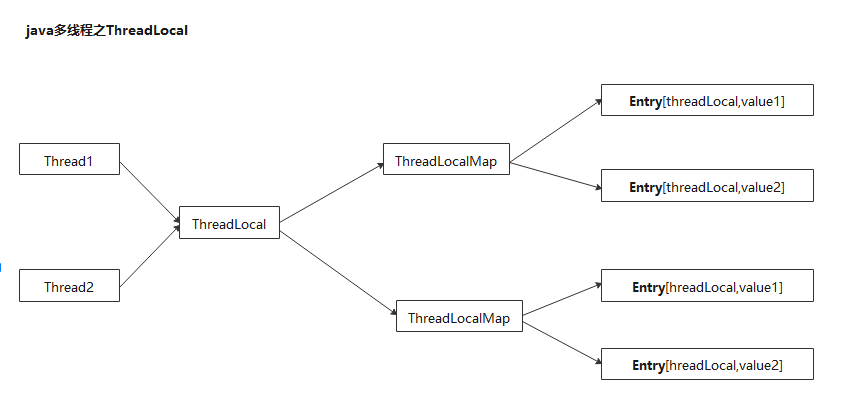

## ThreadLocal

     ThreadLocal:每个线程独有本地变量，解决多线程使用同一变量导致的线程安全问题。
                ThreadLocal是一个线程内部的存储类，可以在指定线程内存储数据，数据存储以后，只有指定线程可以得到存储数据。

     数据应用：如多数据源切换。

注：

    每个Thread内都有2个ThreadLocalMap实例，分别是
    threadLocals：每个线程独有的，不可以访问其他线程的threadLocals中的ThreadLocal
    inheritableThreadLocals：子类可以访问父类中的ThreadLocal

### 

### 参考
    
