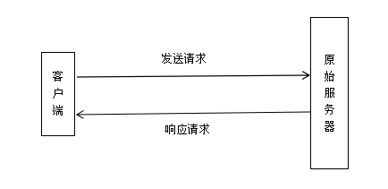
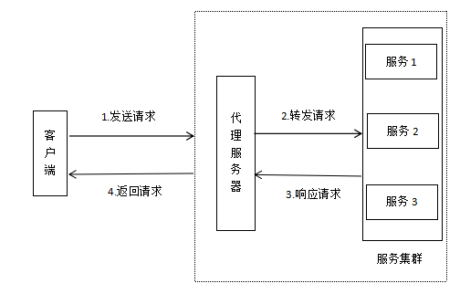

## Nginx 常用技术

###目录

nginx主要用来做反向代理、负载均衡、资源动静分离以及图片服务器。

    1.做负载均衡反向代理:集群；
    
    2.资源动静分离（静态资源由nginx提供，动态资源由tomcat提供:使用nginx或者DNS；
    
    3.缓存:以空间换时间，提高效率；
    
    4.限流：流量控制（队列实现；
    
    5.降级：在并发量特别高时，可以暂时关掉非核心服务。（如日志等只保留报错，警告日志暂时关掉等）。

目录：

    1 nginx介绍
    2 nginx 常用命令（linux）
    3 nginx 配置文件说明
    4 nginx做http服务器（反向代理）
    5 nginx 做图片服务器
    7 负载均衡
    8 动静分离
    9 集群部署

### 1 nginx介绍
  
    nginx是一个web服务器，通常用来实现服务器的反向代理。
    
    常见请求与响应有：正常请求、正向代理、反向代理。

#### 1.1 正常请求

这是开发中比较常见的方式，由客户端直接请求服务器，然后服务器直接对客户端响应数据。如下图所示。

####1.2 正向代理

客户端不能直接请求原始服务器，需要先将请求与请求地址发送给代理服务器，然后由代理服务去将请求转发到原始服务器。原始服务器将结果响应给代理服务器，然后由代理服务器将得到的响应结果返回给客户端。如下图所示。

在此过程中，需要在客户端配置代理服务器的地址（hosts文件）。正向代理是在客户端使用的，是对客户端的代理，由客户端知道并去主动代理。（如翻墙等）

正向代理的作用：

	1.用于访问访问不了的资源（如google翻墙;
	2.可以做代理服务器缓存，加上资源访问;
	3.可以对客户端上网进行认证授权（如校园网;
	4.上网行为的管理，对外隐藏用户信息（原始服务器并不知道访问用户是谁。

#### 1.3 反向代理

客户端将请求发送到服务器（客户端认为是原始服务器，实际是反向代理服务器），反向代理服务器通过一定的策略将请求转发到服务器集群中的服务器上。然后由集群服务器响应结果。反向代理服务去将结果返回给客户端。

在此过程中。客户端是不知道有没有代理服务器。客户端会认为请求的就是原始服务器。

反向代理的作用：

	1.负载均衡，提高请求处理与响应速度（集群）;
	2.保证内网安全，隐藏服务器信息，防止web攻击。

### 2 nginx 常用命令（linux）

默认端口80，配置文件nginx.conf，成功日志access.log，失败日志error.log。

详见：[nginx 常用命令](https://github.com/zlk-github/general-item/blob/master/src/main/java/com/zlk/middleware/nginx/README-COMMAND.md#nginx常用命令)

**注：以下测试主要在windows上进行**

### 3 nginx 配置文件说明

nginx.conf说明。

	#nginx用户
	#user  nobody;
	
	#工作进程数,由cpu核心总数决定最大值
	worker_processes  1;
	
	#错误日志位置
	#error_log  logs/error.log;
	
	#PID文件位置（pid为进程id号）
	#pid        logs/nginx.pid;
	
	#工作模式
	events {
	    #每个进程的最大连接数，默认1024；(如每个进程连接数1000，有两个进程数。则可以提供2000个连接)
	    worker_connections  1024;
	}
	
	#http相关与虚拟主机配置
	http {
	    #支持的媒体类型,类型在文件 mime.types中定义
	    include       mime.types;
		#默认类型
	    default_type  application/octet-stream;
	
		#日志的输出格式
	    #log_format  main  '$remote_addr - $remote_user [$time_local] "$request" '
	    #                  '$status $body_bytes_sent "$http_referer" '
	    #                  '"$http_user_agent" "$http_x_forwarded_for"';
	
		#访问日志的位置
	    #access_log  logs/access.log  main;
	
		#是否调用sendfile函数输出日志
	    sendfile        on;
	    #tcp_nopush     on;
	
	    #连接超时65s
	    keepalive_timeout  65;
	
		#开启gzip压缩
	    #gzip  on;
		
		upstream server_test {
			#加ip_hash后当前用户的请求只能去同一个服务。
			#ip_hash;
			server 10.0.0.11:9090 down;#down 表示单前的server暂时不参与负载.
			#weight权重，max_fails ：允许请求失败的次数默认为1.当超过最大次数时，返回proxy_next_upstream 模块定义的错误.fail_timeout : max_fails次失败后，暂停的时间。
			server 127.0.0.1:1111 weight=4 max_fails=3 fail_timeout=0s;
			server 127.0.0.1:8089 weight=1 max_fails=3 fail_timeout=0s;
			server 127.0.0.1:8088 backup;#backup： 其它所有的非backup机器down或者忙的时候，请求backup机器。所以这台机器压力会最轻。
		}
		
	   server {
	        listen       80;
	        server_name  www.vue.com;
			charset utf-8;
	
	        #access_log  logs/host.access.log  main;
	
			#1前端代理。可以是地址(项目地址G:/git/antd-demo/dist，dist 为Vue项目build后)，也可以使用tomcat
	        location / {
	            root	G:/git/antd-demo/dist;
	            index  	index.html;
	        }
			
		   #2图片服务器，图片地址G:/web/images/下
			location /images/ {  
				root G:/web;
				#开启图片浏览功能
				autoindex on;
			}
			
			#3后台代理，前端访问目录名称。前端访问接口前加www.vue.com/test，如http://www.vue.com/test/user/login?'+new Date().getTime()
			location ^~ /test/ {
			    #server_test对应upstream server_test
				proxy_pass   http://server_test/; 
				
				#连接时间超时时间设置
				#proxy_connect_timeout       1;
				#proxy_read_timeout          1;
				#proxy_send_timeout          1;
	        }
			
			#4静态资源F:/static下
			location  ~ .*\.(jpg|jpeg|gif|png|ico|css|js|pdf|txt)$ {  
				root G:/web/static;
			}
		
	        error_page  404              /404.html;
	        error_page   500 502 503 504  /50x.html;
	        location = /50x.html {
	            root   html;
	        }
		}
	}

### 4 nginx做http服务器（反向代理）

每台物理服务器划分为多个虚拟服务器，每个虚拟主机对应一个web站点。其实就是一台服务器搭建了多个网站。

虚拟主机的地址区分方式：

	1.ip区分（如一台服务器有多个网卡，或者用多台服务器）
	
	2.端口区分（一台服务器，ip相同，使用端口区分。后台开发比较常用）
	
	3.域名区分（实际网站中常用，需要花钱买域名。在该处使用将域名加到hosts文件的方式，只能用于本地测试）

**主要配置**：

 	server {
        listen       80;
        server_name  www.vue.com;
		charset utf-8;

        #access_log  logs/host.access.log  main;

		#前端代理。可以是地址(项目地址G:/git/antd-demo/dist，dist 为Vue项目build后)，也可以使用tomcat
        location / {
            root	G:/git/antd-demo/dist;
            index  	index.html;
        }
		
        error_page  404              /404.html;
        error_page   500 502 503 504  /50x.html;
        location = /50x.html {
            root   html;
        }
    }

在hosts中加入www.vue.com的DNS；

访问www.vue.com，将转向G:/git/antd-demo/dist/index.html;(以上dist是一个vue项目npm run build后得到)

### 5 nginx 做图片服务器

（linux下需要ftp或者sftp进行上传.）

	server {
		    #侦听端口，默认80
	        listen       80;
			#域名，实际中需要申请。该处测试的时候可以在在hosts中加 (ip localhost)
	        server_name  www.vue.com;
			#编码格式
			charset utf-8;
	
			#虚拟主机日志
	        #access_log  logs/host.access.log  main;
			
		    #图片服务器，图片地址G:/web/images/下
			location /images/ {  
				root G:/web;
				#开启图片浏览功能
				autoindex on;
			}
			
	        error_page  404   /404.html;
	        location = /50x.html {
	            root  html;
	        }
		}
	}

访问http://www.vue.com/images/favicon.ico （ G:/web/images/favicon.ico）

### 7 负载均衡

下面展示当前端请求www.vue.com/test/.....相关接口时，转发到127.0.0.1:8088或者127.0.0.1:8089下。

如有**后台接口**http://127.0.0.1:8089/user/login；**前端访问**写为 http://www.vue.com/test/user/login?'+new Date().getTime()

    #后台请求ip配置
	upstream server_test {
			#加ip_hash后当前用户的请求只能去同一个服务。
			#ip_hash;
			server 10.0.0.11:9090 down;#down 表示单前的server暂时不参与负载.
			#weight权重，max_fails ：允许请求失败的次数默认为1.当超过最大次数时，返回proxy_next_upstream 模块定义的错误.fail_timeout : max_fails次失败后，暂停的时间。
			server 127.0.0.1:1111 weight=4 max_fails=3 fail_timeout=0s;
			server 127.0.0.1:8089 weight=1 max_fails=3 fail_timeout=0s;
			server 127.0.0.1:8088 backup;#backup： 其它所有的非backup机器down或者忙的时候，请求backup机器。所以这台机器压力会最轻。
	}

    server {
	    #侦听端口，默认80
        listen       80;
		#域名，实际中需要申请。该处测试的时候可以在在hosts中加 (ip localhost)
        server_name  www.vue.com;
		#编码格式
		charset utf-8;

		#虚拟主机日志
        #access_log  logs/host.access.log  main;

		#前台代理，访问http://localhost时进入前端目录入口D:\Test\vue\vue1\dist\index.html
        location / {
            root	 D:\Test\vue\vue1\dist;
            index  	 index.html;
        }
		
		#后台代理，前端访问目录名称。前端访问接口前加www.vue.com/test，如http://www.vue.com/test/user/login?'+new Date().getTime()
		location ^~ /test/ {
		    #server_test对应upstream server_test
			proxy_pass   http://server_test/; 
			
			#连接时间超时时间设置
			#proxy_connect_timeout       1;
			#proxy_read_timeout          1;
			#proxy_send_timeout          1;
        }
		
		#400错误页面
        error_page  404   /404.html;
        #500错误页面
        location = /50x.html {
            root  html;
        }
	}

### 8 动静分离

让动态资源去后台服务器请求，静态资源去nginx请求。因为nginx处理静态资源速度快。

需要把静态资源单独拷贝处理，在nginx中配置路径。

	server {
		    #侦听端口，默认80
	        listen       80;
			#域名，实际中需要申请。该处测试的时候可以在在hosts中加 (ip localhost)
	        server_name  www.vue.com;
			#编码格式
			charset utf-8;
	
			#虚拟主机日志
	        #access_log  logs/host.access.log  main;
			
		 	#静态资源F:/static下
			location  ~ .*\.(jpg|jpeg|gif|png|ico|css|js|pdf|txt)$ {  
				root G:/web/static;
			}
		
	        error_page  404   /404.html;
	        location = /50x.html {
	            root  html;
	        }
		}
	}

### 9 nginx集群

#### 9.1 NGINX主从备份

    NGINX实现主从备份目前主流方案是Keepalived+Nginx实现双机热备。

#### 9.2 NGINX分布式集群

### 总结

nginx主要用来做反向代理、负载均衡、资源动静分离以及图片服务器。

### 参考

    http://nginx.org