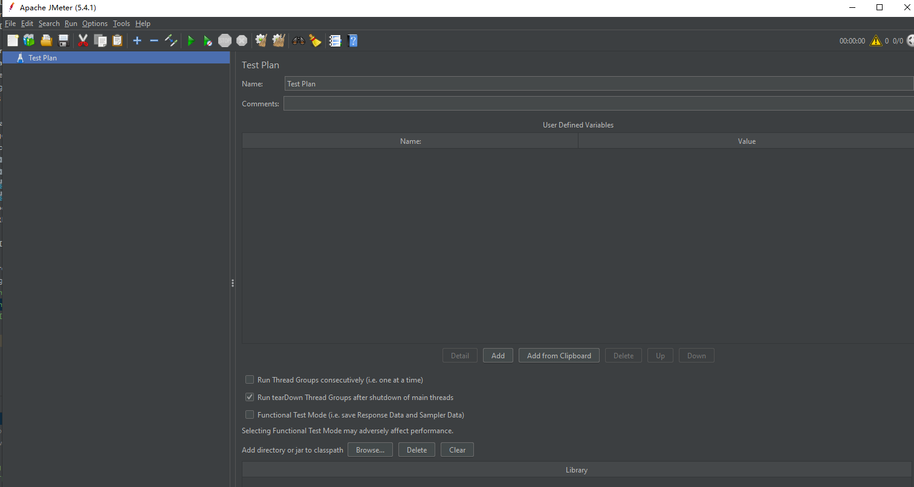

## 压测之jmeter

### 1 下载安装 

前置条件需要安装JDK，见https://www.cnblogs.com/keyforknowledge/p/11230252.html

jmeter下载地址： http://jmeter.apache.org/download_jmeter.cgi

jmeter安装参考：https://blog.csdn.net/hanhanwanghaha/article/details/105682642

下載地址如下图

下载后解压，并启动bin目录下jmeter.bat

jmeter命令界面

jmeter工作界面

可以在Options中选择语言。

### 1.1 创建测试计划

### 1.2 创建线程组

测试计划--》创建线程组，配置线程数与循环次数。

    配置用户数与循环次数  总请求次数=配置线程数*循环次数

### 1.3 创建http请求

线程组--》创建http请求

    配置协议，ip，端口，请求方式，请求路径等。

    如果需要可以添加响应断言

### 1.4 创建察看结果树

线程组--》察看结果树  

    用于查看接口请求情况。
    注：查看结果树叶可以只针对当前接口

### 1.5 执行jmeter

### 参考

    官网 https://jmeter.apache.org/usermanual/